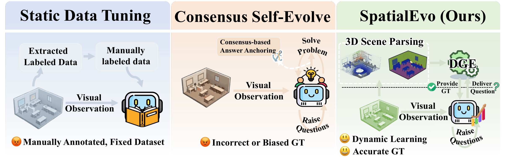
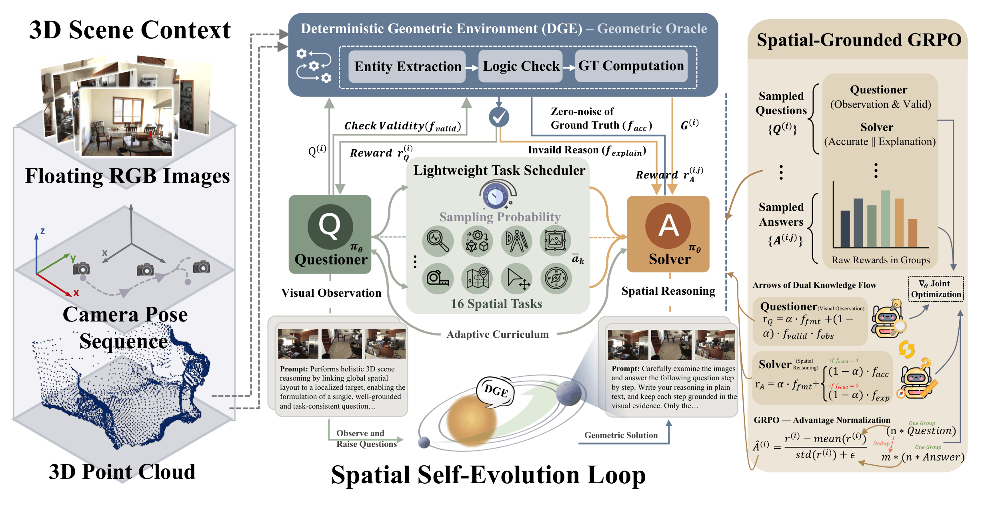
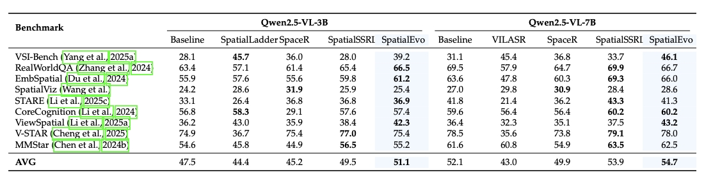

<div align="center">

<h1 style="text-align:center;">
SpatialEvo: Self-Evolving Spatial Intelligence via Deterministic Geometric Environments
</h1>

_A self-evolving framework for 3D spatial reasoning with deterministic geometric feedback_

<p align="center">
  <a href="https://arxiv.org/abs/2604.14144" target="_blank">
    
  </a>
  <a href="https://huggingface.co/lidingm/SpatialEvo-3B" target="_blank">
    
  </a>
  <a href="https://huggingface.co/lidingm/SpatialEvo-7B" target="_blank">
    
  </a>
  <a href="https://huggingface.co/datasets/lidingm/SpatialEvo-160K" target="_blank">
    
  </a>
</p>

</div>

## 🎉 News
- **2026.04.16:** We release our paper, model, dataset and codes.

## 📦 What This Repo Provides

| Component               | Description                                                  |
| ----------------------- | ------------------------------------------------------------ |
| **DGE Simulator**       | Geometric oracle supporting 16 spatial task categories with deterministic GT computation |
| **Dataset Pipelines**   | Processing scripts for ScanNet, ScanNet++, and ARKitScenes into a unified scene format |
| **QA Data Generation**  | Offline pipeline for generating and curating spatial QA pairs via the DGE |
| **SpatialEvo Training** | Full GRPO-based online self-evolution training stack with reward functions and task scheduler |
| **Model Weights**       | Released checkpoints for SpatialEvo-3B and SpatialEvo-7B     |
| **Training Dataset**    | SpatialEvo-160K, an offline QA dataset generated by the DGE to demonstrate its data generation capability        |

## 📝 Overview

**Spatial reasoning** requires models to maintain persistent perception and understanding of three-dimensional scenes, yet continuously driving model iteration at scale remains bottlenecked by annotation costs. The **self-evolving paradigm**naturally fits this domain: its demand for active scene perception aligns with self-play, and crucially, visual inputs in spatial reasoning inherently carry **3D point clouds and camera poses** that can be programmatically parsed into exact ground truth, fundamentally circumventing the reliance on model voting that plagues existing self-evolving methods.

**SpatialEvo** is the first self-evolving framework for 3D spatial reasoning, centered on a **Deterministic Geometric Environment (DGE)** that transforms unannotated 3D scene assets into zero-noise online reward judges across 16 spatial task categories. A single shared-parameter policy co-evolves as both a **Questioner** and a **Solver**, while a lightweight **Task Scheduler** adapts the sampling distribution based on historical accuracy, driving an adaptive curriculum without manual intervention. This repository releases the full SpatialEvo codebase, including the DGE Simulator, dataset processing pipelines, and the training stack used for the paper.

## 🌟 Why SpatialEvo?

<p align="center">
  
</p>

The figure above contrasts SpatialEvo with two common training paradigms. **Static data tuning** depends on fixed manually labeled datasets, limiting scalability and making high-quality geometric supervision expensive to obtain. **Consensus-based self-evolving** methods reduce annotation cost but construct reward signals via model voting, introducing systematic bias that is particularly harmful when precise geometric grounding is required. SpatialEvo breaks this limitation by exploiting a property unique to 3D spatial reasoning: visual inputs inherently carry physical information such as 3D point clouds and camera poses that can be programmatically parsed into exact ground truth. By grounding self-evolution in the **DGE**, SpatialEvo replaces noisy pseudo-labels with deterministic physical feedback, enabling noise-free continuous model improvement without any manual annotation.

## 📈 Spatial Self-Evolution with DGE

<p align="center">
  
</p>

SpatialEvo starts from real 3D scene assets, including floating RGB observations, camera pose sequences, and point clouds. These inputs are passed into the **Deterministic Geometric Environment**, which performs entity extraction, logic checking, and ground-truth computation under task-specific verification rules. The DGE therefore acts as the geometric oracle inside the training loop, deciding whether a generated question is valid and, when valid, returning exact ground truth rather than a model-voted answer.

On top of the DGE, SpatialEvo adopts a spatial-grounded GRPO training procedure. A single model alternates between Questioner and Solver roles under shared parameters. The Questioner is responsible for scene observation and question generation, while the Solver is responsible for geometric reasoning and invalidity explanation. A lightweight scheduler tracks historical performance across task categories and adaptively shifts sampling probability toward the model's current weak spots, forming a curriculum that emerges automatically from training dynamics rather than from manual stage design.

## 📊 Main Results

<p align="center">
  
</p>

SpatialEvo achieves the best average performance at both backbone scales shown in the main table, reaching **51.1** on **Qwen2.5-VL-3B** and **54.7** on **Qwen2.5-VL-7B**. The gains are especially strong on core spatial benchmarks such as VSI-Bench, EmbSpatial, and ViewSpatial, while general visual understanding remains competitive on broader evaluation sets such as MMStar and RealWorldQA. These results show that geometry-grounded self-evolution can improve specialized spatial reasoning without sacrificing overall multimodal capability.

## ⚙️ Setup

SpatialEvo uses a single dependency entry point through `easy_r1/pyproject.toml`, so installation can be kept simple. After creating and activating your environment, install the project from the repository root:

```bash
conda create -n spatialevo python=3.10 -y
conda activate spatialevo
pip install -e ./easy_r1
```

If you need the optional development tools, you can instead run:

```bash
pip install -e "./easy_r1[dev]"
```

## 🤖 External LLM / VLM Configuration

At the moment, SpatialEvo does **not** use one single global config file for all external LLM/VLM calls. The configuration is partially unified: the **DGE Simulator side** is managed centrally through `config/rubric_config.yaml`, while the **easy_r1 training side** uses its own reward-function config inside `easy_r1/examples/config_spatialevo.yaml`.

For the **DGE Simulator**, the default entry point is `config/rubric_config.yaml`. This file manages the runtime backend for both question/entity extraction and invalid-recovery assistance. In most cases, users only need to fill the `api_key` and `base_url` fields under `tools.vlm_tool`, and optionally provide separate values under `tools.invalid_recovery_tool` if they want the invalid-recovery branch to use a different backend. A typical configuration looks like:

```yaml
tools:
  vlm_tool:
    model: "<LLM_MODEL_NAME>"
    vision_model: "<VLM_MODEL_NAME>"
    api_key: "<YOUR_API_KEY>"
    base_url: "<YOUR_OPENAI_COMPATIBLE_BASE_URL>"

  invalid_recovery_tool:
    model: null
    vision_model: null
    api_key: null
    base_url: null
```

When `invalid_recovery_tool` is left as `null`, it inherits the main `vlm_tool` backend. If needed, the **DGE Simulator** can also be overridden programmatically through the `WorldSimulator(...)` constructor by passing `vlm_api_key` and `vlm_base_url`, but for open-source usage the YAML file is the recommended place to configure it.

## ✏️ Data Preparation

All dataset preparation code is organized under `data/`. SpatialEvo provides processing pipelines for **ScanNet**, **ScanNet++**, and **ARKitScenes**, and normalizes them into a shared ScanNet-like layout with extracted `frame_processed/` images and `metadata/` files so that the **DGE Simulator** and training pipeline can consume one unified scene interface. To prepare data for your own experiments, please start from `data/README.md`, then follow the scripts in `data/scannet_process/`, `data/scannetpp_process/`, and `data/arkitscene_process/` according to the dataset you want to use.

## 🖇️ DGE Simulator Usage

The public **DGE Simulator** interface is centered around `src/simulator/world_simulator.py`. We provide runnable examples in `examples/` for scene-level tasks, single-image tasks, image-pair tasks, and invalid-recovery cases. These examples are the recommended starting point, because they already include complete request formats for the supported modalities and show how to call the **DGE Simulator** in practice. Before running them, please edit the dataset root and scene-path variables inside the example files so that they match your local processed data.

Once the paths are set, you can run the examples from the project root:

```bash
python examples/scene_tasks_example.py
python examples/single_image_tasks_example.py
python examples/image_pair_tasks_example.py
python examples/invalid_recovery_example.py
python examples/run_all_examples.py
```

In practice, the **DGE Simulator** mainly exposes two interfaces: `get_environment_summary(...)`, which summarizes a scene or image context, and `validate_and_answer(...)`, which verifies a spatial question under DGE rules and returns the answer or the invalidity diagnosis. The example scripts cover the supported scene, single-image, and image-pair task families and are the easiest way to understand the intended usage pattern.

## 🚀 Training

The SpatialEvo training code is placed under `easy_r1/`. To launch training, simply change into that directory and run the provided script:

```bash
cd easy_r1
bash train_spatialevo.sh
```

The main experiment configuration is stored in `easy_r1/examples/config_spatialevo.yaml`. This file controls the model path, rollout behavior, two-round training setup, logging, checkpointing, and the rest of the core experiment settings. If you want to reproduce the paper configuration or adapt it to your own cluster, this is the main place to edit.

The external LLM/VLM services used by the reward functions are configured **separately from the DGE Simulator**. Specifically, `easy_r1` passes user-defined backend settings through `worker.reward.reward_function_kwargs`. If you want the Round-1 question-quality reward and the Round-2 invalid-reason judging branch to call an OpenAI-compatible service, you should fill the corresponding URL and API key here. A recommended template is:

```yaml
worker:
  reward:
    reward_function: ./training/reward_function/unified_reward.py:compute_score
    reward_function_kwargs:
      question_quality_kwargs:
        model: "<LLM_MODEL_NAME>"
        api_key: "<YOUR_API_KEY>"
        service_url: "<YOUR_OPENAI_COMPATIBLE_BASE_URL>"
        timeout: 30

      majority_correctness_kwargs:
        model: "<LLM_MODEL_NAME>"
        api_key: "<YOUR_API_KEY>"
        service_url: "<YOUR_OPENAI_COMPATIBLE_BASE_URL>"
        timeout: 30
```

If you want to use different backends for invalid-reason judging in Round 2, `majority_correctness_kwargs` also supports dedicated fields such as `invalid_reason_judge_model`, `invalid_reason_judge_api_key`, and `invalid_reason_judge_url`. In other words, the current project structure separates external-service configuration into two layers: `config/rubric_config.yaml` for the **DGE Simulator**, and `easy_r1/examples/config_spatialevo.yaml` for reward-time training calls.

We also release the RL training dataset used in the paper at `easy_r1/dataset/spatialevo_train.jsonl`, so the default training entry already points to a reproducible data source. In other words, the standard workflow is to adjust `easy_r1/train_spatialevo.sh` and `easy_r1/examples/config_spatialevo.yaml` for your environment, then launch training with the command above.

## 🙏 Acknowledgement

Our training framework is built upon **[MS-Swift](https://github.com/modelscope/ms-swift)** and **[EasyR1](https://github.com/hiyouga/EasyR1)**. We sincerely thank the developers of these projects for their valuable contributions to the open-source community.

## 📚 Citation
If you find SpatialEvo useful, please consider citing our work:

```bibtex
@misc{li2026spatialevoselfevolvingspatialintelligence,
      title={SpatialEvo: Self-Evolving Spatial Intelligence via Deterministic Geometric Environments}, 
      author={Dinging Li and Yingxiu Zhao and Xinrui Cheng and Kangheng Lin and Hongbo Peng and Hongxing Li and Zixuan Wang and Yuhong Dai and Haodong Li and Jia Wang and Yukang Shi and Liang Zhao and Jianjian Sun and Zheng Ge and Xiangyu Zhang and Weiming Lu and Jun Xiao and Yueting Zhuang and Yongliang Shen},
      year={2026},
      eprint={2604.14144},
      archivePrefix={arXiv},
      primaryClass={cs.CV},
      url={https://arxiv.org/abs/2604.14144}, 
}
```
